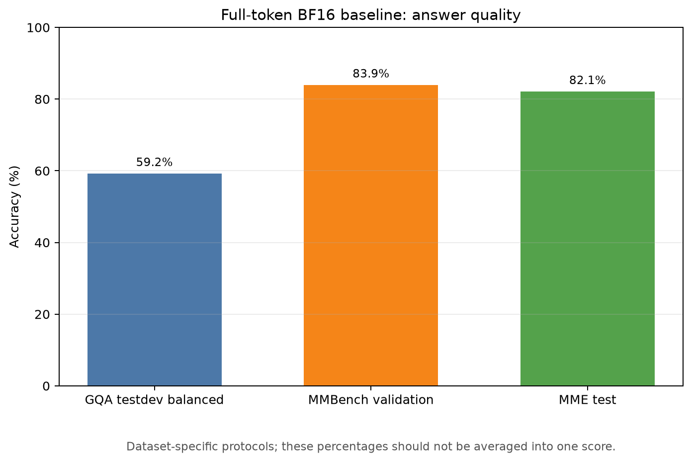
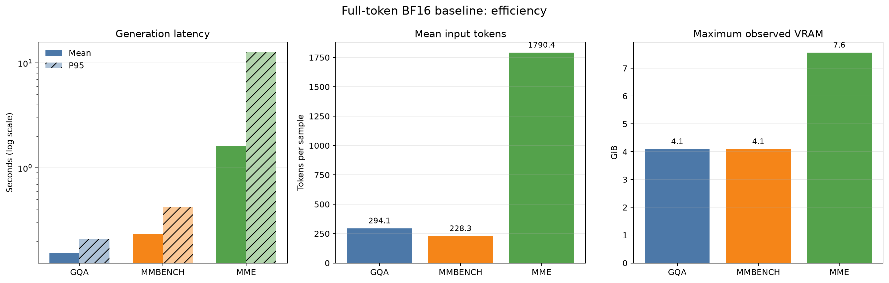
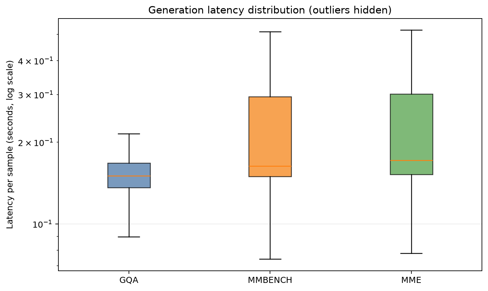
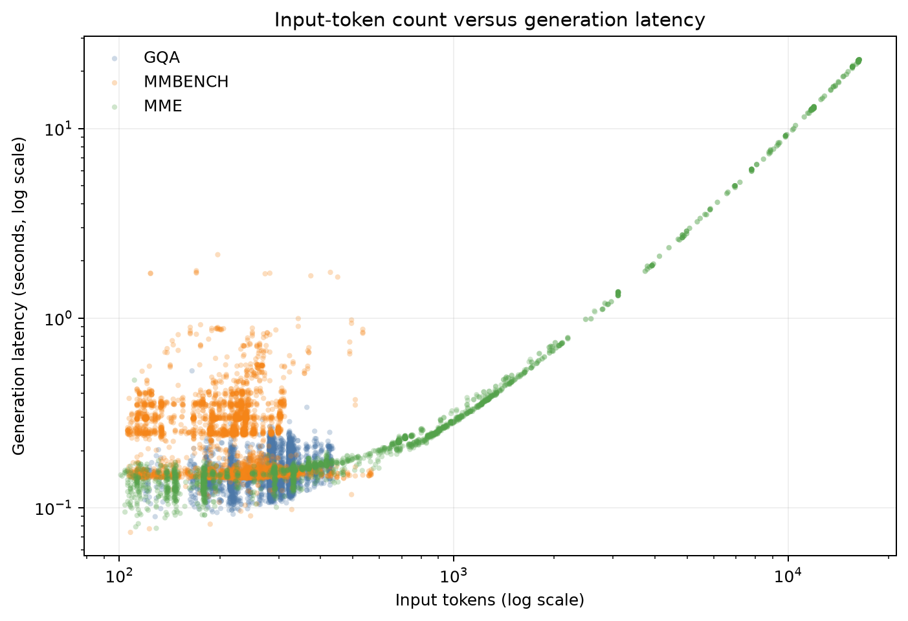
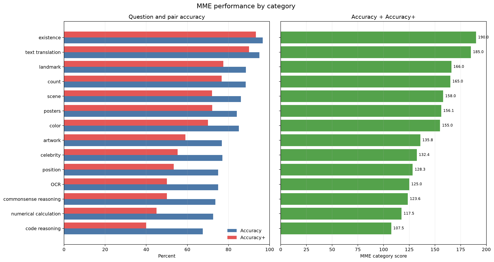

# Qwen3-VL-2B-Instruct Full-Token BF16 Baseline

## Run identity

- Model: `Qwen/Qwen3-VL-2B-Instruct`
- Precision: `bf16`
- Pruning method: `none`
- Report schema: `1.1`

## How to interpret this report

Quality and efficiency are deliberately reported as separate axes. Higher
accuracy and MME scores are better; lower latency, token count, and VRAM are
better. A useful token-reduction method should reduce computation while keeping
the quality loss small. The three benchmark accuracies must not be averaged
because their tasks and scoring protocols differ.

## Metric definitions and rationale

### Answer-quality metrics

| Metric | Definition used in this project | Why it is reported |
| --- | --- | --- |
| Labelled rows | Samples with an available reference answer or answer label. Unlabelled rows are excluded from the accuracy denominator. | Makes the evaluated sample count explicit and prevents missing labels from silently lowering accuracy. |
| GQA accuracy | Percentage of labelled questions whose prediction exactly matches any reference after trimming, case-folding, and collapsing repeated whitespace. | Directly measures open-ended visual question answering quality on the balanced GQA split. |
| MMBench accuracy | Percentage of labelled questions with the correct A–E option. The parser accepts an option label or an exact match to the option text. | Measures multiple-choice multimodal reasoning while handling the two common answer formats. |
| MME question accuracy | Percentage of individual yes/no questions answered correctly. The first `yes` or `no` token in the prediction is compared with the reference. | Gives an intuitive question-level percentage, but it is supplementary to the official-style MME score. |
| MME Accuracy+ | Within one category, the percentage of complete image pairs for which both paired yes/no questions are correct. | Penalizes inconsistent perception: one correct answer from a positive/negative pair is not sufficient. |
| MME category score | `question accuracy (%) + Accuracy+ (%)`; range 0–200 for each category. | Preserves both per-question correctness and pair consistency. |
| MME total score | Sum of all category scores. This report contains 14 categories, so the observed scale is 0–2800. | This is the primary aggregate used to compare MME runs; it is not a percentage and should not be compared numerically with GQA/MMBench accuracy. |

### Efficiency metrics

| Metric | Definition used in this project | Why it is reported |
| --- | --- | --- |
| Generation latency | Wall-clock seconds around `model.generate()` for one sample. Image preprocessing, prompt construction, decoding text, file I/O, and metric computation are excluded. | Isolates model-generation cost, which visual-token pruning is intended to reduce. |
| Mean latency | Arithmetic mean of per-sample generation latency. | Summarizes overall runtime, but can be pulled upward by slow samples. |
| Median latency | Middle per-sample latency. | Represents a typical sample and is robust to a long latency tail. |
| P95 latency | Deterministic sorted-index estimate of the 95th percentile; approximately 95% of samples are no slower than this value. | Captures tail latency that the mean can hide, especially for high-resolution images with many visual tokens. |
| Maximum latency | Slowest recorded sample. | Exposes worst observed behavior and helps identify samples for diagnosis. |
| Input tokens | Length of the processor-produced input sequence, including text tokens and visual placeholder positions replaced by visual embeddings. | Serves as a direct workload proxy for the language decoder. |
| Output tokens | Number of tokens generated after the input prompt. | Separates response-length effects from input visual-token effects. |
| Peak VRAM | Maximum CUDA memory allocated during generation after resetting peak-memory statistics; includes resident model memory plus generation-time tensors and KV cache. | Shows whether a method improves memory feasibility, not only speed. |

The current full-token baseline retains 100% of the visual tokens emitted by
Qwen3-VL's built-in 2×2 spatial patch merger. Future pruning reports should add
the retained visual-token count and ratio while keeping these definitions
unchanged.

## Quality

| Benchmark | Labelled rows | Accuracy | MME score |
| --- | ---: | ---: | ---: |
| GQA testdev balanced | 12,578 | 59.18% | — |
| MMBench validation | 4,329 | 83.90% | — |
| MME test | 2,374 | 82.06% | 2045.13 |

**Figure 1 — Quality accuracy.** Each bar is the dataset-specific percentage
defined above. Use it to compare the same benchmark across model or pruning
runs. Do not average the three bars or compare the MME percentage with its
separate total score.

## Efficiency

### Runtime and memory

| Benchmark | Mean latency (s) | Median (s) | P95 (s) | Maximum (s) | Total generation (min) | Peak VRAM (GiB) |
| --- | ---: | ---: | ---: | ---: | ---: | ---: |
| GQA testdev balanced | 0.1549 | 0.1504 | 0.2101 | 0.5268 | 32.48 | 4.09 |
| MMBench validation | 0.2371 | 0.1634 | 0.4220 | 2.1596 | 17.11 | 4.09 |
| MME test | 1.6062 | 0.1717 | 12.6834 | 23.0717 | 63.55 | 7.56 |

### Token counts

| Benchmark | Mean input tokens | P95 input tokens | Mean output tokens | Maximum output tokens |
| --- | ---: | ---: | ---: | ---: |
| GQA testdev balanced | 294.1 | 361.0 | 2.3 | 10 |
| MMBench validation | 228.3 | 326.0 | 3.8 | 32 |
| MME test | 1790.4 | 11876.0 | 2.0 | 2 |

**Figure 2 — Efficiency overview.** The first panel compares mean and P95
generation latency on a logarithmic scale, the second compares mean input
tokens, and the third shows maximum observed VRAM. Mean describes aggregate
cost; P95 and maximum VRAM expose difficult high-cost samples.

**Figure 3 — Latency distribution.** Box centers are medians, boxes span the
25th–75th percentiles, and whiskers use the standard 1.5×IQR rule. Outlier
markers are hidden to keep the three distributions readable, but those samples
remain included in every table statistic. The vertical axis is logarithmic.

**Figure 4 — Input tokens versus latency.** Each point is one sample; both axes
are logarithmic. An upward trend indicates that longer multimodal sequences
cost more generation time and therefore offer an opportunity for visual-token
reduction. For readability, at most 5,000 deterministically
spaced records per dataset are plotted; table metrics always use every record.

## MME category analysis

- Highest category score: `existence` (190.00).
- Lowest category score: `code_reasoning` (107.50).
- Total MME score: 2045.13.

**Figure 5 — MME categories.** The left panel separates question Accuracy from
pair Accuracy+. The right panel shows their sum, sorted from weakest to
strongest category. This reveals whether a pruning method damages particular
capabilities even when the total score appears stable.

## Output integrity

| Benchmark | Rows | Unique sample IDs | Duplicate IDs | Empty predictions |
| --- | ---: | ---: | ---: | ---: |
| GQA testdev balanced | 12,578 | 12,578 | 0 | 0 |
| MMBench validation | 4,329 | 4,329 | 0 | 0 |
| MME test | 2,374 | 2,374 | 0 | 0 |

Duplicate IDs or empty predictions should be zero before results are treated
as a valid benchmark. These checks verify output completeness; they do not
replace dataset-version and prompt-configuration provenance in `manifest.json`.

## Artifact layout

- `summary.json`: machine-readable metrics and efficiency statistics.
- `tables/benchmark_summary.csv`: one row per benchmark.
- `tables/mme_categories.csv`: MME category-level values.
- `manifest.json`: report identity, input provenance, and generated files.
- `figures/`: deterministic numbered figures in reading order.
